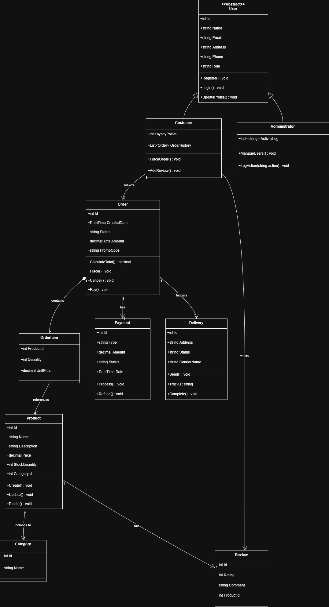
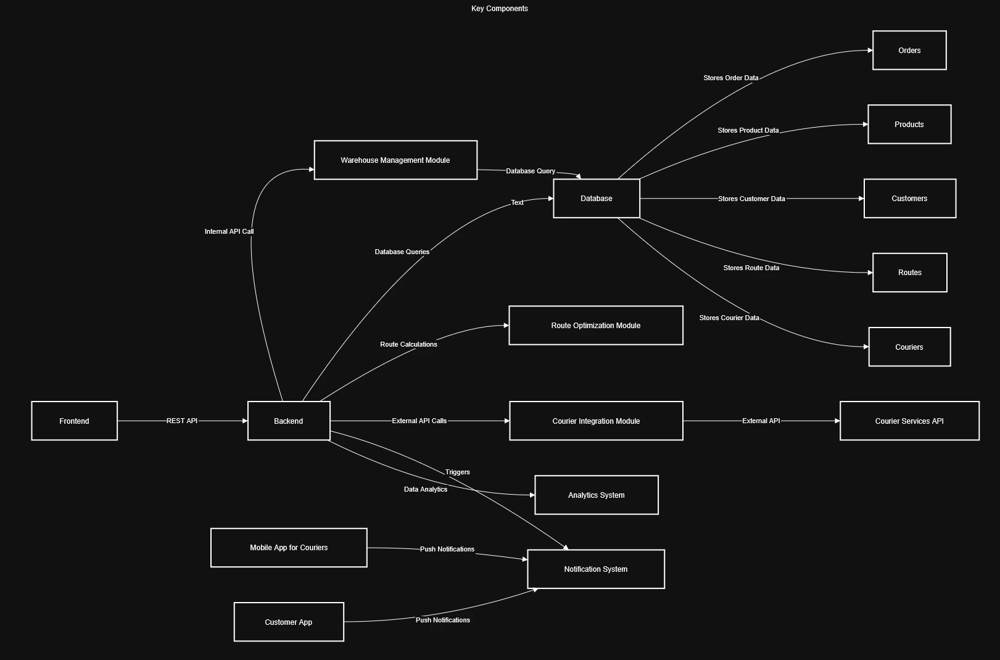

# Диаграммы проекта

Репозиторий содержит две диаграммы, размещённые в папке `docs/`.

## Диаграмма архитектуры
Файлы:
- [Electronicstore.webp](https://app.diagrams.net/?repo=nhslo/-CSE5072--home11&path=Electronicstore.drawio)
- Electronicstore.drawio

## Диаграмма процессов
Файлы:
- LDSM.webp
- LDSM.drawio

